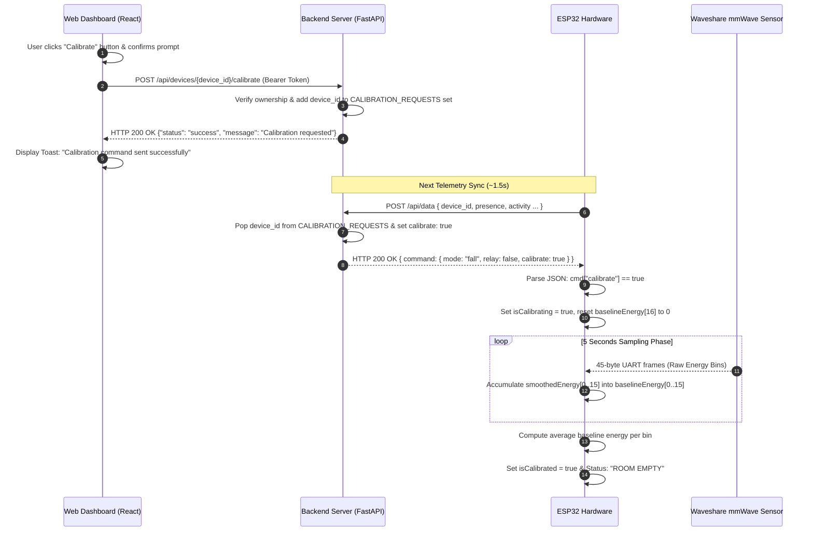

# Calibration Flow Specification & Execution Guide

This document provides a complete technical specification of what occurs across the **Frontend (React Web Dashboard)**, **Backend (FastAPI Server)**, and **ESP32 Hardware (mmWave Radar)** when a user clicks the **Calibrate** button.

---

## 1. Executive Summary

Calibration is the process of sampling and recording the ambient electromagnetic noise floor of an empty room. 

Because the Waveshare 24GHz mmWave radar measures presence via energy spikes (`spike = smoothedEnergy[i] - baselineEnergy[i]`), calibrating the sensor maps background static reflections (from walls, furniture, or stationary fixtures) so that subsequent movement detection is accurate and false motion alerts are eliminated.

---

## 2. Sequence Diagram



---

## 3. Detailed Step-by-Step Technical Breakdown

### Step 1: User Triggers Action in Frontend (`DeviceManagement.js`)
- **Location**: `frontend/src/pages/DeviceManagement.js` (`handleCalibrateDevice`)
- **User Action**: The user clicks the **Calibrate** button on a device card in the Device Management page.
- **Confirmation Prompt**: A modal dialog asks:
  > *"Trigger calibration for [Device Name]? Make sure the room is empty and stand clear for 5 seconds."*
- **HTTP Request**: Upon confirmation, the frontend fires an HTTP request:
  - **Method & Endpoint**: `POST /api/devices/{device_id}/calibrate`
  - **Header**: `Authorization: Bearer <access_token>`

---

### Step 2: Backend Processing & Queueing (`main.py`)
- **Location**: `backend/main.py` (`@app.post("/api/devices/{device_id}/calibrate")`)
- **Authorization**: Backend verifies device ownership using `database.verify_device_ownership(device_id, user_id)`.
- **In-Memory Queueing**: Backend adds the device ID to an in-memory calibration request queue:
  ```python
  CALIBRATION_REQUESTS.add(device_id)
  ```
- **Logging**: Creates a system log entry: `event="Calibration requested"`.
- **HTTP Response**: Returns `HTTP 200 OK`:
  ```json
  {
    "status": "success",
    "message": "Calibration requested"
  }
  ```
- **UI Feedback**: Frontend displays a green toast notification: *"Calibration command sent successfully"*.

---

### Step 3: Command Delivery to ESP32 Hardware (`main.py`)
- **Location**: `backend/main.py` (`receive_sensor_data`)
- **Trigger**: ESP32 autonomously posts telemetry to `POST /api/data` every ~1.5 seconds.
- **Backend Response Logic**:
  ```python
  calibrate = False
  if data.device_id in CALIBRATION_REQUESTS:
      calibrate = True
      CALIBRATION_REQUESTS.remove(data.device_id)
  ```
- **HTTP 200 Response Payload Delivered to ESP32**:
  ```json
  {
    "status": "success",
    "message": "Data received",
    "command": {
      "mode": "fall",
      "relay": false,
      "relay_mode": "manual",
      "calibrate": true
    }
  }
  ```

---

### Step 4: ESP32 Hardware Execution & Noise Floor Sampling (`hmmd_mmwave.ino`)
- **Location**: `Firmware/hmmd_mmwave.ino` (`send_data()`, `updateCalibration()`, `processRadarData()`)
- **JSON Command Parsing**: In `send_data()`, ESP32 parses the HTTP 200 response JSON. When `cmd["calibrate"] == true`:
  ```cpp
  isCalibrating = true;
  calibrationStartTime = millis();
  calibrationSamples = 0;
  memset(baselineEnergy, 0, sizeof(baselineEnergy));
  Serial.println("[SYSTEM] Calibration triggered remotely via backend!");
  ```
- **5-Second Sampling Phase**: For the next **5,000 milliseconds (5 seconds)**, as 45-byte UART radar frames arrive from the Waveshare sensor, `updateCalibration()` accumulates energy levels across all 16 spectrum bins:
  ```cpp
  void updateCalibration() {
    if (isCalibrating) {
      for (int i = 0; i < 16; i++) {
        baselineEnergy[i] += smoothedEnergy[i];
      }
      calibrationSamples++;

      if (millis() - calibrationStartTime > 5000) {
        for (int i = 0; i < 16; i++) {
          baselineEnergy[i] /= calibrationSamples; 
        }
        isCalibrating = false;
        isCalibrated = true;
        statusText = "ROOM EMPTY";
        Serial.println("[SYSTEM] Calibration Complete.");
      }
    }
  }
  ```

---

### Step 5: Post-Calibration Sensor Inference Behavior
- Once `isCalibrated = true`, `inferPresence()` calculates motion activity by comparing live smoothed energy against the newly calculated baseline energy:
  ```cpp
  for (int i = 2; i <= 10; i++) {
    int spike = smoothedEnergy[i] - baselineEnergy[i];
    if (spike > maxSpike) {
      maxSpike = spike;
    }
  }
  ```
- If static reflections change in the room (e.g. furniture re-arranged or fan moved), clicking **Calibrate** resets `baselineEnergy[16]` and updates the zero-reference point instantly.
