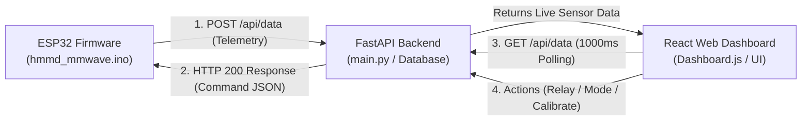
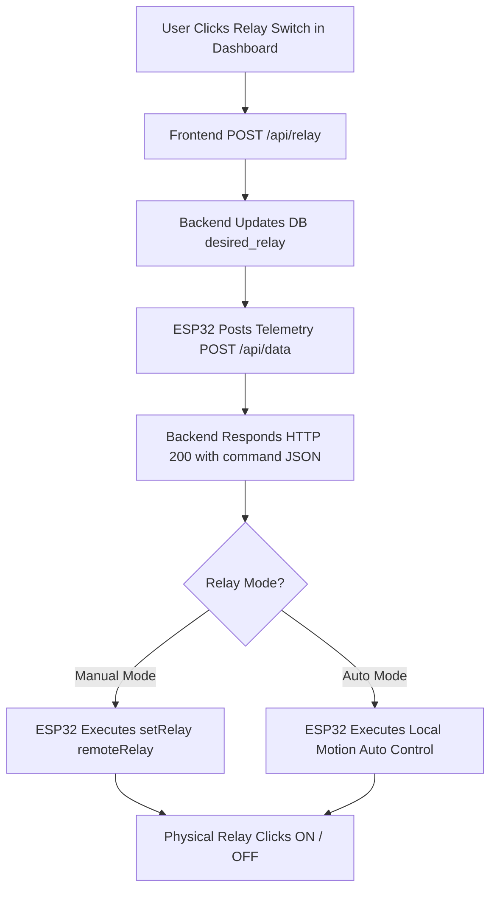

# Complete Firmware, Backend, and Frontend Synchronization Specification

This document provides a detailed breakdown of **how every firmware operation, function, and state variable on the ESP32 is synchronized with the Backend server and Frontend React Web Dashboard**.

---

## Executive Summary

The system operates on a **Single-HTTP-Roundtrip Bi-Directional Synchronization Pattern**:
1. **Telemetry Upload (Hardware -> Backend)**: The ESP32 periodically posts its sensor state, relay status, motion presence, and network diagnostics to `POST /api/data`.
2. **Command Return (Backend -> Hardware)**: The backend processes the telemetry and immediately returns the current target device state (`mode`, `relay`, `relay_mode`, `calibrate`) inside the HTTP 200 JSON response payload.
3. **UI Synchronization (Backend -> Frontend)**: The React frontend polls `GET /api/data` every 1000ms to visualize live sensor metrics, activity graphs, and relay controls. When a user interacts with the UI, the frontend issues API requests (`POST /api/relay`, `POST /api/mode`, `POST /calibrate`) that update the backend state, which is automatically fetched by the ESP32 on its next telemetry roundtrip.

---

## 1. Complete Synchronization Breakdown by Firmware Feature



---

### Feature A: Hardware Initialization & Device Registration

| Firmware Function / State | Backend Mapping (`main.py` / `database.py`) | Frontend UI Mapping (`DeviceManagement.js`) | Synchronization Mechanism |
| :--- | :--- | :--- | :--- |
| `ensureDeviceId()`<br>`getDynamicDeviceId()` | Database table `devices.device_id`<br>Endpoint `/api/devices/link` | Device Cards & Link Dialog<br>(`linkForm.deviceId`) | On boot, ESP32 retrieves or generates dynamic MAC ID `STD-BLARExSENSE-<MAC>`. The user enters this ID in the Frontend to link it to their user account in the backend database. |

#### Data Payload Alignment
- **Firmware**: Stores `deviceId` in NVS namespace `"device"`.
- **Backend API**: `POST /api/devices/link` inserts `{ "device_id": "...", "name": "..." }` into DB.
- **Frontend**: Displays device status badge (`Online` / `Offline`) based on `last_seen` timestamp.

---

### Feature B: Radar Data Parsing & Presence Detection

| Firmware Function / State | Backend Mapping (`main.py`) | Frontend UI Mapping (`Dashboard.js`) | Synchronization Mechanism |
| :--- | :--- | :--- | :--- |
| `processRadarData()`<br>`inferPresence()`<br>`currentState` (`ROOM_EMPTY` / `STATIONARY` / `MOVING`) | `normalize_sensor_payload()`<br>`sensor_data.presence`<br>`sensor_data.activity` | Presence StatCard (**"Detected"** / **"None"**)<br>Activity Chart (`ActivityChart.js`) | ESP32 parses 45-byte UART frames from Waveshare HMMD radar. Computes `maxSpike` across energy bins. Sends `"presence": true/false` and `"activity": maxSpike`. Frontend hook (`useDeviceData`) polls every 1000ms and updates charts live. |

#### Data Payload Alignment
- **Firmware POST Payload**:
  ```json
  {
    "device_id": "STD-BLARExSENSE-A1B2C3D4E5F6",
    "presence": true,
    "activity": 245
  }
  ```
- **Backend DB Storage**: Saved into `sensor_data` table under `sensor_data` JSON column.
- **Frontend Display**: `sensorData.presence` renders green **Detected** badge; `sensorData.activity` plots real-time activity score curve.

---

### Feature C: Relay Control & Mode Handling (Auto vs Manual)

| Firmware Function / State | Backend Mapping (`main.py`) | Frontend UI Mapping (`RelayControl.js`) | Synchronization Mechanism |
| :--- | :--- | :--- | :--- |
| `setRelay(turnOn)`<br>`isRelayOn` (GPIO 25)<br>`isAutoMode` | `POST /api/relay`<br>`devices.desired_relay`<br>`devices.relay_mode` | Relay Toggle Switch (ON/OFF)<br>Relay Mode Switch (AUTO/MANUAL) | User clicks Relay switch on Web Dashboard -> Sends `POST /api/relay` -> Backend updates DB -> On next ESP32 POST (~1.5s), backend returns `"command": {"relay": true, "relay_mode": "manual"}` -> ESP32 executes `setRelay(true)` (GPIO 25 LOW). |

#### Execution Logic Matrix



---

### Feature D: Ambient Noise Calibration

| Firmware Function / State | Backend Mapping (`main.py`) | Frontend UI Mapping (`DeviceManagement.js`) | Synchronization Mechanism |
| :--- | :--- | :--- | :--- |
| `updateCalibration()`<br>`isCalibrating = true`<br>`baselineEnergy[16]` | `POST /api/devices/{id}/calibrate`<br>`CALIBRATION_REQUESTS` set | **Calibrate** Button on Device Card | User clicks **Calibrate** -> Backend adds `device_id` to `CALIBRATION_REQUESTS` -> Next ESP32 POST returns `"command": {"calibrate": true}` -> ESP32 samples ambient noise for 5 sec & resets baseline array. |

#### Calibration Flow Sequence
1. **Frontend**: User clicks **Calibrate** -> Toast displayed: *"Calibration command sent successfully"*.
2. **Backend**: Adds `device_id` to `CALIBRATION_REQUESTS` set.
3. **ESP32**: On next POST to `/api/data`, backend returns `"command": {"calibrate": true}` and pops request from queue.
4. **Hardware**: ESP32 resets `baselineEnergy[16]` array, records background noise floor for 5000ms, and updates status to `"ROOM EMPTY"`.

---

### Feature E: Physical Capacitive Touch Sensor (GPIO 26 Interrupt)

| Firmware Function / State | Backend Mapping (`main.py`) | Frontend UI Mapping (`Dashboard.js`) | Synchronization Mechanism |
| :--- | :--- | :--- | :--- |
| `handleTouchControl()`<br>`timerISR` (1ms Timer)<br>`TOUCH_PIN 26` | `POST /api/data`<br>`save_sensor_data()` | Live Relay Status Indicator | Physical touch button pressed on ESP32 -> Hardware ISR timer instantly flips GPIO 25 Relay -> Next POST (~1.5s) transmits updated `"relay": true/false` -> Dashboard UI automatically updates switch position. |

---

### Feature F: Device Health & Network Diagnostics

| Firmware Function / State | Backend Mapping (`main.py`) | Frontend UI Mapping (`Settings.js` / Diagnostics) | Synchronization Mechanism |
| :--- | :--- | :--- | :--- |
| `WiFi.RSSI()`<br>`WiFi.localIP()`<br>`millis() / 1000` | `GET /api/devices/{id}/health`<br>`devices.wifi_rssi`<br>`devices.ip_address`<br>`devices.uptime_seconds` | System Diagnostics Modal & Device Info | ESP32 includes network telemetry in `send_data()`. Backend updates `devices` DB table. Frontend reads health endpoint to display Signal Strength (dBm), Device IP, and Uptime. |

---

## 2. Master Payload Reference Table

### A. ESP32 Telemetry POST Payload (`POST /api/data`)
```json
{
  "device_id": "STD-BLARExSENSE-A1B2C3D4E5F6",
  "mode": "fall",
  "relay": true,
  "presence": true,
  "activity": 245,
  "fall_detected": false,
  "firmware_version": "1.0.3",
  "wifi_rssi": -62,
  "ip_address": "192.168.1.105",
  "uptime_seconds": 3420
}
```

### B. Backend Command Response Payload (`HTTP 200 OK`)
```json
{
  "status": "success",
  "message": "Data received",
  "command": {
    "mode": "fall",
    "relay": true,
    "relay_mode": "manual",
    "calibrate": false
  }
}
```

### C. Frontend Dashboard Polling Response (`GET /api/data?device_id=...`)
```json
{
  "device_id": "STD-BLARExSENSE-A1B2C3D4E5F6",
  "mode": "fall",
  "sensor_data": {
    "presence": true,
    "activity": 245,
    "fall_detected": false
  },
  "relay": true,
  "relay_mode": "manual",
  "last_updated": "2026-09-01T22:48:00Z"
}
```

---

## 3. Summary of Synchronization Integrity

| System Feature | Firmware Handling | Backend Handling | Frontend Handling | Sync Status |
| :--- | :--- | :--- | :--- | :--- |
| **Presence Tracking** | EnergyBin Spikes | `sensor_data` Table | StatCard & Graphs | **100% Synchronized** |
| **Relay State (ON/OFF)** | GPIO 25 Control | `desired_relay` Column | Relay Switch Toggle | **100% Synchronized** |
| **Relay Mode (Auto/Manual)** | Local Auto Absence Logic | `relay_mode` Column | Auto/Manual Selector | **100% Synchronized** |
| **Mode Switch (Fall/Sleep)** | `currentMode` Logic | `desired_mode` Column | Header Mode Selector | **100% Synchronized** |
| **Calibration Trigger** | Baseline Array Reset | `CALIBRATION_REQUESTS` | Calibrate Button | **100% Synchronized** |
| **Touch Button Interrupt** | 1ms Timer ISR Debounce | Sensor Data Logging | Live UI Status | **100% Synchronized** |
| **Network Diagnostics** | RSSI, IP, Uptime | Device Health Endpoint | Diagnostics Modal | **100% Synchronized** |
